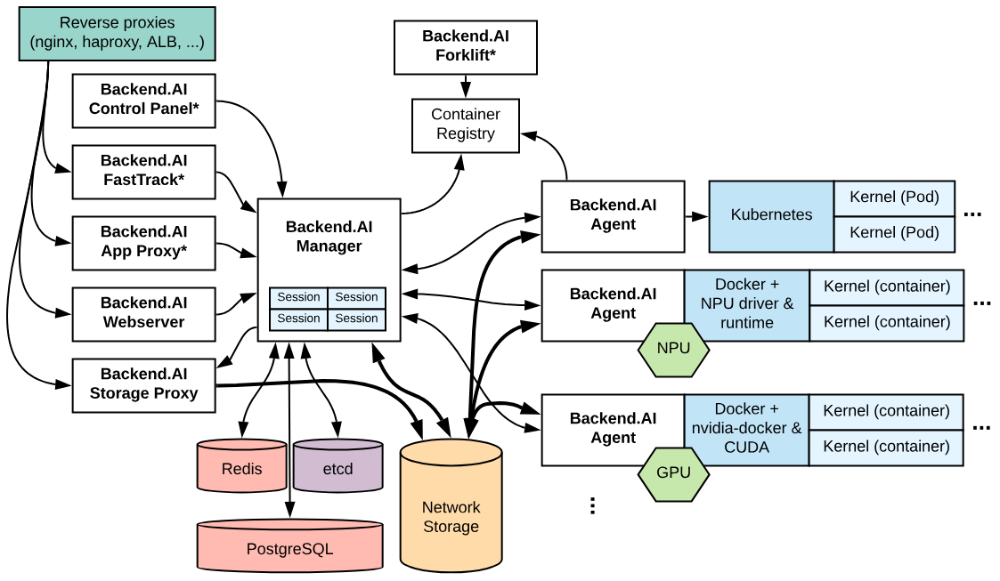

<h1 style=" font-weight: bold; font-size: 40px;">Web Development</h1>

1. Ứng dụng web là một phần quan trọng của internet, phục vụ nhiều lĩnh vực như tin tức, giải trí, thể thao, lập trình, blog, du lịch,... Hiện có hàng tỷ trang web hoạt động với các tính năng đa dạng.

2. Các thành phần của một ứng dụng web
 + FrontEnd : 
    - Là phần người dùng tương tác trưng tiếp. Gồm : nội dung, màu sắc, phông chữ, bố cục, ...
    - Frontend developer tạo ra giao diện của một trang web, tối ưu người dùng, cải thiện hiệu suất của trang web
    - Một số thư viện và framework phổ biến 
        + ReactJS
        + AngularJS
        + Next.js
        + VueJS
        + Svelte
        + SolidJS
        + Qwik
        + Bootstrap, Foundation, Tailwind, Bulma, Material-UI, Ant Design, ShadcnUI...
 
 + Backend: Xương sống công nghệ, kiến tạo nền tảng cho mọi trải nghiệm mượt mà

    

    - Dữ liệu người dùng cung cấp phải được xử lý và lưu trữ hiệu quả.
    - Các hệ quản trị cơ sở dữ liệu, máy chủ, dịch vụ,... là những thành phần cốt lõi của backend.
    - Backend developers 
        + Chịu trách nhiệm xử lý dữ liệu và cung cấp chúng cho ứng dụng web
        + Họ có thể được ví như kỹ sư xây dựng, đảm bảo nền móng vững chắc cho hệ thống.
     - Một số công cụ và ngôn ngữ phổ biến xây dựng các ứng dụng backend 
        + NodeJS
        + PHP
        + C#
        + Python 
        + Golang
        + MySQL, MongoDB, ...

 + DevOps: Con mắt thần, dự đoán lỗi và tối ưu hiệu suất trước khi hệ thống 'đổ bệnh'

     
    
    -  Đóng vai trò quan trọng trong việc tự động hóa và tối ưu quy trình phát triển phần mềm. 
    - Giúp rút ngắn thời gian triển khai, tăng cường bảo mật và nâng cao hiệu suất hệ thống.
    - DevOps bao gồm nhiều công cụ và phương pháp như:
        + Quản lý mã nguồn: Git, GitHub, GitLab, Bitbucket.
        + CI/CD: Jenkins, GitHub Actions, GitLab CI/CD, CircleCI.
        + Containerization & Orchestration: Docker, Kubernetes.
        + Giám sát & Logging: Prometheus, Grafana, ELK Stack.
        + Hạ tầng & Cloud: AWS, GCP, Azure, Terraform, Ansible.
3. 
DOM (Document Object Model) : Api Biểu  diễn tài liệu HTML/XML dưới dạng cây cấu trúc cho phép tạo phần tử 

HTMl DOM : chuẩn hóa các phương thức truy cập các phần tử HTML ( properties ,methods , events)

4. CORS : ( Cross-Origin Resource Sharing )
- Cơ chế cho phép truy cập tài nguyên từ domain khác vượt qua chính sách Same-Origin của trình duyệt 
- Ví dụ : Gọi Api từ domain khác cần cấu hình cors headers

5. RESTful API
- API tuân thủ nguyên tắc REST , sử dụng HTTP methods (get ,post,put, delete) thao tác crud

6. Các phương thức http reqquest khác có 9 phương thức :
- get, post , put , delete , head, patch, connect, options, trace 
- vi du : patch dùng để cập nhật một phần dữ liệu , khác với put ghi đè toàn bộ

7. Cookie, Session, Local Storage, Session Storage 
+ Cookie : Lưu trên trình duyệt , gửi tự động server và đính cookie , hạn sử dụng lâu
+ Session : Lưu trên server, hết hiệu lực khi đóng trình duyệt
+ Loacal Storage : Lưu trữ dữ liệu lâu dài ( 10 mb)
+ Session Storage : Chỉ tồn tại một phiên làm việc 
8. OLAP vs. OLTP
+ OLAP (Online Analytical Processing) :
   - Phân tích dữ liệu 
   - Thực hiện nhiều truy vấn phức tạp , đọc nhiều hơn ghi
   - Dữ liệu tổng hợp , tổ chức mô hình dữ liệu ( Data Warehouse)
   - Ví dụ : Báo cáo doanh số 
+ OLTP (Online Transaction Processing)
   - Xử lí giao dịch trực tuyến 
   - Đọc/Ghi dữ liệu nhanh , hỗ trợ nhiều giao dịch đồng thời 
   - Dữ liệu chi tiết , được chuẩn hóa để tránh dư thừa 
   - Ví dụ : Hệ thống quản lí đơn hàng , ứng dụng ngân hàng trực tiếp
   
   