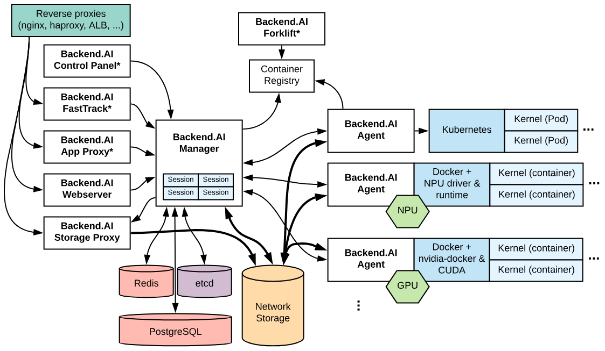

<h1 style=" font-weight: bold; font-size: 40px;">Web Development</h1>

1. Ứng dụng web là một phần quan trọng của internet, phục vụ nhiều lĩnh vực như tin tức, giải trí, thể thao, lập trình, blog, du lịch,... Hiện có hàng tỷ trang web hoạt động với các tính năng đa dạng.

2. Các thành phần của một ứng dụng web
 + FrontEnd : 
    - Là phần người dùng tương tác trưng tiếp. Gồm : nội dung, màu sắc, phông chữ, bố cục, ...
    - Frontend developer tạo ra giao diện của một trang web, tối ưu người dùng, cải thiện hiệu suất của trang web
    - Một số thư viện và framework phổ biến 
        + ReactJS
        + AngularJS
        + Next.js
        + VueJS
        + Svelte
        + SolidJS
        + Qwik
        + Bootstrap, Foundation, Tailwind, Bulma, Material-UI, Ant Design, ShadcnUI...
 + Backend: Xương sống công nghệ, kiến tạo nền tảng cho mọi trải nghiệm mượt mà

